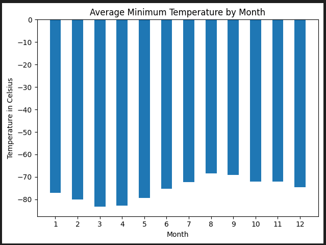
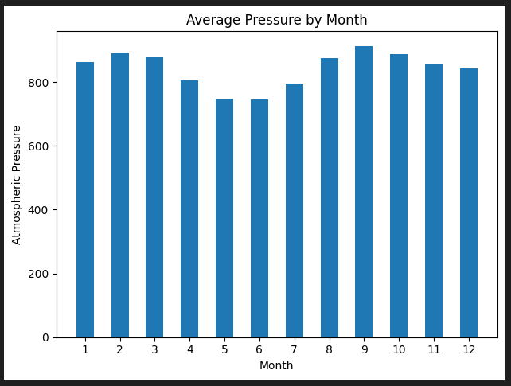
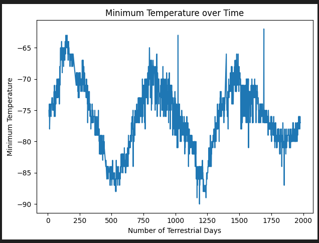

# Module 11: mars-soup-challenge

## The Task
Using Splinter and Beautiful Soup, scrape Mars news articles, as well as Mars weather data.

## User Story
```md
AS AN astronomy enthusiast
I WANT to automatically scrape information about Mars from the Internet 
SO THAT I stay up to date on Mars news and weather.
```

## Acceptance Criteria
```md
Part 1: Scrape Titles and Preview Text from Mars News
  * Automated browsing (with Splinter) was used to visit the Mars news site, and the HTML code was extracted (with Beautiful Soup).
  * The titles and preview text of the news articles were scraped and extracted.
  * The scraped information was stored in the specified Python data structure—specifically, a list of dictionaries.

Part 2: Scrape and Analyze Mars Weather Data
  * The HTML table was extracted into a Pandas DataFrame. Either Pandas or Splinter and Beautiful Soup were used to scrape the data. The columns have the correct headings and data types.
  * The data was analyzed to answer the following questions:
    - How many months exist on Mars?
    - How many Martian days' worth of data are there?
  * The data was analyzed to answer the following questions, and a data visualization was created to support each answer:
    - Which month, on average, has the lowest temperature? The highest?
    - Which month, on average, has the lowest atmospheric pressure? The highest?
    - How many terrestrial days exist in a Martian year? A visual estimate within 25% was made.
  * The DataFrame was exported into a CSV file.
```

## Visualizations
### Mars Weather Data:






## License
This project is licensed under the GNU General Public License v3.0.  
License Link:
https://www.gnu.org/licenses/gpl-3.0.en.html   
[](https://www.gnu.org/licenses/gpl-3.0)
